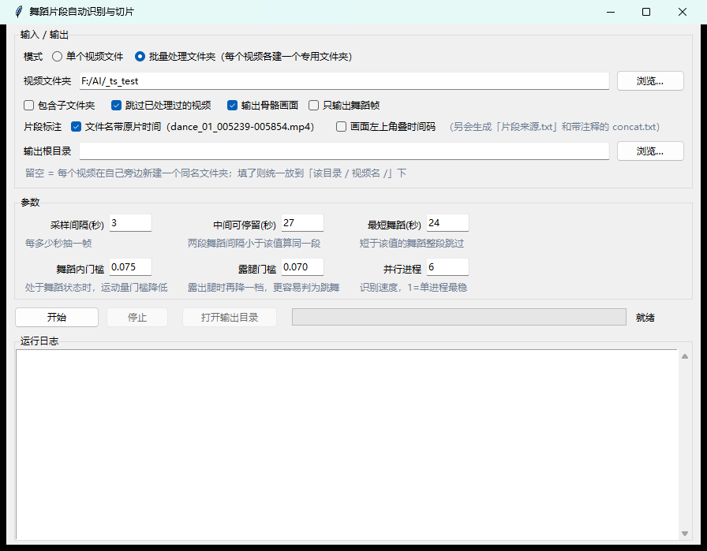
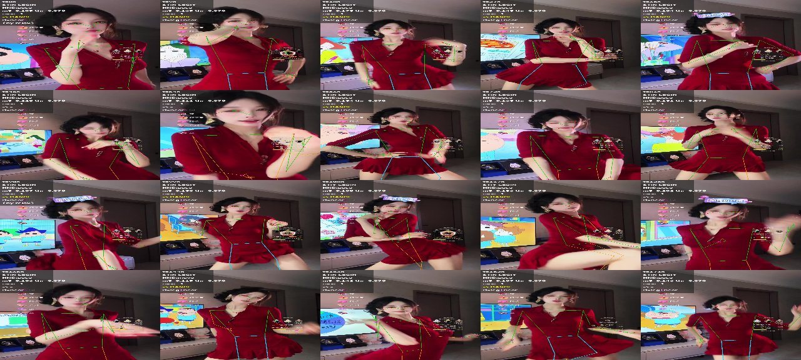

# DanceCut · 舞蹈片段自动识别与切片

从长视频（直播录像、带货回放、课程录制）里**自动找出所有跳舞的片段并切出来**。
基于 MediaPipe 的人体骨骼 + 手部骨骼 + 帧间运动量三路判据，全程本地运行，不依赖任何云端服务。



---

## ⚠️ 授权：源码开放，禁止商用

本项目采用 **PolyForm Noncommercial License 1.0.0**（完整条款见 [LICENSE](LICENSE)）。

| | |
|---|---|
| ✅ **允许** | 个人学习、研究、兴趣项目；修改、二次开发；非商业性分发（需保留本协议与署名） |
| ❌ **禁止** | 任何**商业用途**——包括但不限于：出售本软件或基于它的服务、用于付费/广告变现的产品、集成进商业产品、公司内部经营性使用 |
| 💬 **商业授权** | 如需商用请联系作者单独获取授权 |

> **一句话：可以拿去自己用、随便改，但不能拿去赚钱。**
>
> 严格来说这属于「源码开放（source-available）」而非 OSI 定义的开源协议——
> 因为 OSI 开源协议不允许限制使用领域。中文说明另见 [NOTICE.md](NOTICE.md)。

---

## 特性

- **三路判据**：站立取景 + 手部舞蹈姿态 + 持续运动量，三者同时成立才算舞蹈帧
- **两条条件放松**：处于舞蹈状态时降低运动量门槛；画面露出腿时更容易判为跳舞
  （解决"动作幅度小但确实在跳"被漏掉的问题）
- **批量模式**：给一个文件夹，自动处理里面所有视频，**每个视频在它旁边新建一个同名专用文件夹**
- **骨骼画面输出**：把 33 点人体骨架 + 21 点手部骨架画回采样图，附判定数值面板，一眼看出判定依据
- **片段来源标注**：文件名 / 清单 / 画面时间码三处标明每段取自原片的哪个区间
- **中文路径可用**：绕过 OpenCV 在 Windows 上读不了中文路径的老问题
- **GPU 加速**：切片优先用 `h264_nvenc`，不可用自动回退 `libx264`
- **可打包成 exe**：PyInstaller 一键打包，分发给不装 Python 的人

## 快速开始

### 依赖

```bash
pip install -r requirements.txt
```

另外需要 **ffmpeg**（不随仓库分发，请自行下载并把 `ffmpeg.exe` 放到 `app/` 目录）：
<https://www.gyan.dev/ffmpeg/builds/> 或 <https://github.com/BtbN/FFmpeg-Builds/releases>

> 模型文件（`models/*.task`）已随仓库提供，来自 Google MediaPipe，Apache-2.0。

### 方式一：图形界面（推荐）

```bash
python app/dance_cut.py
```

界面上：

1. 选模式：**批量处理文件夹**（默认）或 **单个视频文件**
2. 批量模式下选中文件夹，里面每个视频会在自己旁边新建一个同名专用文件夹放结果
3. 参数一般不用动，点「开始」

命令行等价写法：

```bash
# 单个视频
python app/dance_cut.py --cli --video 视频.mp4 --out 输出目录

# 批量：每个视频各建一个同名文件夹
python app/dance_cut.py --cli --batch D:\我的视频 --workers 6

# 可选开关
#   --skeleton             输出骨骼画面
#   --skeleton-only-dance  只给舞蹈帧出骨骼图（省空间）
#   --burn-ts              画面左上角烧录原片时间码
#   --no-ts-name           文件名不带原片时间
#   --recursive            含子文件夹
#   --no-skip              不跳过已处理过的视频

# 自检：验证 ffmpeg / 模型 / 推理链路 / 中文路径 / 批量逻辑
python app/dance_cut.py --self-test
```

### 方式二：打包成 exe

```
双击 app\build_exe.bat
```

产出的 `app\DanceCut\DanceCut.exe` 可以脱离 Python 环境运行。

> 用 `--onedir` 而不是 `--onefile` 是刻意的：程序内含 87MB 的 ffmpeg，
> 单文件版每次启动都要解包 140MB（实测 2 分 50 秒），文件夹版启动只要 1~3 秒。

### 方式三：源码流水线（方法参考）

`pipeline/` 里的 7 个脚本是这套方法最初的实现（分步执行、可以逐阶段检查中间结果），
适合研究判定逻辑。它们需要自己指定路径：

```bash
set DANCECUT_ROOT=D:\work
set DANCECUT_VIDEO=D:\work\video.mp4
python pipeline/analyze.py      # ① 全量人体骨骼 + 帧间运动量
python pipeline/motion.py       # ② 帧间运动量
python pipeline/finalize.py     # ③ 三判据合成 + 逐帧判定
python pipeline/extract_hands.py# ④ 舞蹈帧的手部骨骼
python pipeline/build_clips.py  # ⑤ 剪辑规则 + 切片
python pipeline/make_report.py  # ⑥ 自包含 HTML 报告
```

> 通用场景请直接用 `app/dance_cut.py`，它把整条链路收成一个程序且路径无关。

## 判定规则

### 基础三条（同时成立才算舞蹈帧）

| 判据 | 含义 | 阈值 |
|---|---|---|
| ① **站立取景** | 肩中点画面高度 `sh_y`、肩宽 `sh_w`，**或者**露出腿 | `sh_y < 0.44` 且 `sh_w < 0.27`，或腿部关键点可见 |
| ② **手部骨骼＝舞蹈** | 手腕高于/接近肩、手臂外展、屈肘抬起，或手腕有位移 | `up > -0.40` / `lat > 0.45` / `肘角 < 115°`，或 `Δwrist > 0.45` 倍躯干长 |
| ③ **持续运动** | 相邻采样帧画面差分运动量的 3 帧滚动均值 | `m³ > 0.09` |

### 两条条件放松（提高召回）

以**高置信锚点**（基础三条全过 且 `m³ > 0.13`）前后 ±2 个采样（±6 秒）为"处于舞蹈状态"的边界：

- **放松 A**：锚点邻域内 → 运动量门槛降到 **0.075**，手部姿态判据放宽
- **放松 B**：锚点邻域内 **且** 露出腿 → 门槛再降到 **0.070**，站立/手部判据都放宽

> **「露出腿」用关键点可见度判断**：膝关节可见度 > 0.35 或踝关节 > 0.20。
> 紧机位下髋/膝/踝会被 MediaPipe 外推出画面、可见度≈0，所以这个指标能区分"桌面近景"和"能看到腿"的取景。

### 两个踩过的坑（都写进代码注释了）

**① `露腿` ≠ `站立`。** 主播坐在矮沙发上时腿一样会入镜，所以非露腿的放松帧额外要求
肩膀够高（`sh_y < 0.42`）；但**露腿帧不能强求这条**——近机位下肩膀本来就偏低，强求会整段漏检。

**② 只靠肩部判据会在近机位直播上完全失效。** 竖屏/贴脸直播里肩宽远超 0.27，
实测某 46 分钟视频只有 14/917 帧被判为"站立"，导致 0 片段。所以「露出腿」必须能**独立**满足判据 ①。
（同一视频里 53% 的帧能看到腿，其中 83% 运动量超阈值。）

### 剪辑规则

- 片段起点取**上一张非舞蹈采样图**的时间点，终点取下一张 → 保证舞蹈首尾不被切掉
- 中间停留 ≤ 27 秒视为同一段，不拆开
- 舞蹈本身 < 24 秒整段跳过
- 保持原始画面，不做任何裁切

## 输出

每个视频的专用文件夹里：

```
<视频名>/
├── frames/                     每 N 秒抽出来的截图
├── skeleton/                   骨骼画面（勾选后才有）+ _总览.jpg + _说明.txt
├── clips/
│   ├── dance_01_005239-005854.mp4   切好的片段（文件名带原片时间区间）
│   ├── ALL_DANCE.mp4                所有片段合成的合集
│   ├── concat.txt                   拼接清单（注释带每段原片区间）
│   └── 片段来源.txt                  来源对照表 + 合集内位置对照
├── dance_result.csv            逐帧判定表（各项指标 + 最终判定 + 用了哪档放松）
├── dance_clips.csv             片段清单
├── dance_blocks_analysis.csv   合并与过滤过程（哪个块被丢弃、为什么）
└── run_summary.json            本次运行汇总
```

骨骼画面长这样（绿=人体骨骼，青=腿部，品红=手部骨骼，左上角是判定数值）：



## 目录结构

```
Dance-Cut/
├── app/
│   ├── dance_cut.py        主程序（GUI + 命令行 + 自检，单文件无第三方 UI 依赖）
│   ├── build_exe.bat       PyInstaller 打包脚本
│   └── 使用说明.md          给最终用户的中文说明书
├── pipeline/               分步流水线脚本（方法参考）
├── models/                 MediaPipe 模型
├── docs/                   截图
├── requirements.txt
├── LICENSE                 PolyForm Noncommercial 1.0.0
└── NOTICE.md               中文授权说明 + 第三方组件声明
```

## 常见问题

**Q：检测结果不准怎么办？**
先看 `dance_result.csv`——里面每一帧都有完整指标（`sh_y` / `sh_w` / `leg_vis` / `hand_pose` /
`m_roll3` / `m_thr` / `base` / `relax_level`），能直接看出是哪一条判据卡住了。
配合勾上「输出骨骼画面」看判定依据最直观。

**Q：想要更高召回 / 更低误判？**
界面上「舞蹈内门槛」「露腿门槛」两个数值可直接调：调高到 0.09 = 关掉对应放松，调低 = 更宽松。

**Q：跑得慢？**
把「并行进程」设为 CPU 核数-1；切片会自动用 GPU 编码（需 NVIDIA 显卡 + nvenc）。

**Q：支持多长的视频？**
实测 4 小时 720p 全流程约 6 分钟（6 进程）。

## 第三方组件

| 组件 | 用途 | 许可 |
|---|---|---|
| [MediaPipe](https://github.com/google-ai-edge/mediapipe) | 人体/手部关键点检测 | Apache-2.0 |
| MediaPipe Pose / Hand 模型（`models/*.task`） | 关键点模型权重 | Apache-2.0 |
| [FFmpeg](https://ffmpeg.org/) | 抽帧、切片、合成（**不随仓库分发**） | LGPL / GPL |
| [OpenCV](https://opencv.org/) | 图像读写与绘制 | Apache-2.0 |

## 许可

[PolyForm Noncommercial License 1.0.0](LICENSE) —— 源码开放，**禁止商用**。
商业授权请联系仓库作者。
